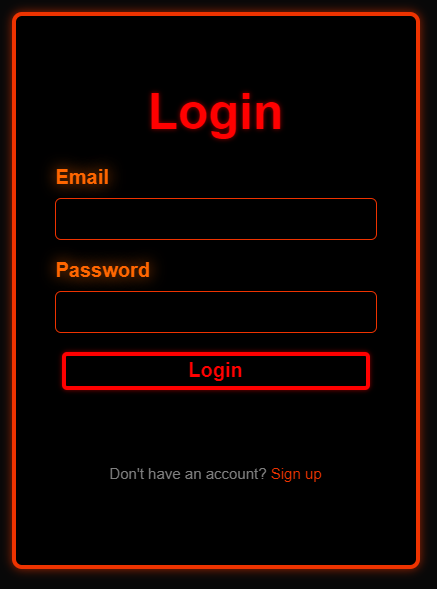
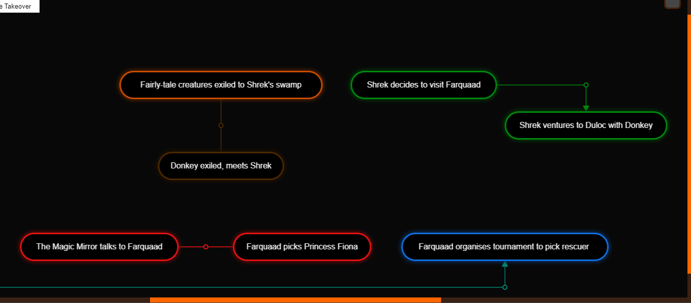

# Old Version Screenshots

Intended to be used as inspiration, not as a blueprint.

## AUTH

Has a cookie that will be set if you have logged in before.
It will show the 'login' page by default if so, the 'sign up' if not.

## DASH
Can create, delete, and view projects here.

### SETTINGS
All pages have a tab on the top-right for settings.

This one has a crude theme selection menu.

## PROJECT

### PROJECT SETTINGS
Change title, description, permissions, and wiki sources.

Sources are used to create links to external sources.

## TIMELINE
See your pages in chronological form, linked by causality.

### NODES
Can represent locations, characters, objects, organizations, events, and more.

### LINKS
Can represent how nodes are related.

Cause: 'A' directly causes 'B'.

Factor: 'A' was somewhat involved in the cause of 'B'.

Extension: 'A' and 'B' were caused together.

### SELECTION
Can swiftly delete selected nodes, or move them using the arrow keys.

## WIKI
### MAIN PAGE

### SPECIAL PAGES

### SEARCH PAGE

### CREATE PAGE

### VIEW PAGE

### EDIT PAGE

### TALK PAGE

